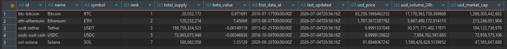

#  ₿ Crypto Coins ETL Pipeline 💱


## Overview

This project implements an end-to-end ETL (Extract, Transform, Load) pipeline that retrieves cryptocurrency market data from the CoinPaprika API, performs data transformation using Pandas, and loads the cleaned data into a PostgreSQL database.

The pipeline is orchestrated using **Apache Airflow** (Astronomer Runtime)

<table width="100%">
<tr>
<td align="left">

</td>

<td align="center">

</td>
<td align="center">

</td>

<td align="right">

</td>
</tr>
</table>


## Data Source 📚
API Endpoint: https://api.coinpaprika.com/v1/tickers

---

## ETL Process ♻️

### 1. Extract

- Sends an HTTP GET request to the CoinPaprika API
- Retrieves cryptocurrency market data in JSON format
- Converts the JSON response into a Pandas DataFrame

---

### 2. Transform

Here the following operations have been done:

- Filter only 5 selected cryptocurrencies
- Select relevant columns from the data
- Rename columns to meaningful names
- Prepares the data for loading into PostgreSQL


### 3. Load

Here cleaned data is loaded into PostgreSQL.

- Create the `coin_etl` schema if it does not exist
- Create the destination table if it does not exist
- Appends new records into the PostgreSQL table

## Airflow Orchestration 

The ETL pipeline is orchestrated using Apache Airflow TaskFlow API.

Pipeline tasks:

```
Extract >> Transform >> Load
```

The DAG runs every **day** `0 0 * * *`

## Installation

Clone the repository

```bash
git clone https://github.com/HoseaMutwiri/crypto-etl-airflow.git

cd crypto_etl_project
```

Install dependencies

```bash
pip install -r requirements.txt
```

---

## Running with Astronomer

Start Airflow

```bash
astro dev start
```

Open Airflow UI

```
http://localhost:<port>
```

Trigger the DAG

```
pipeline_coins
```

---

## Sample Output(use DBeaver to connect to postgres)



